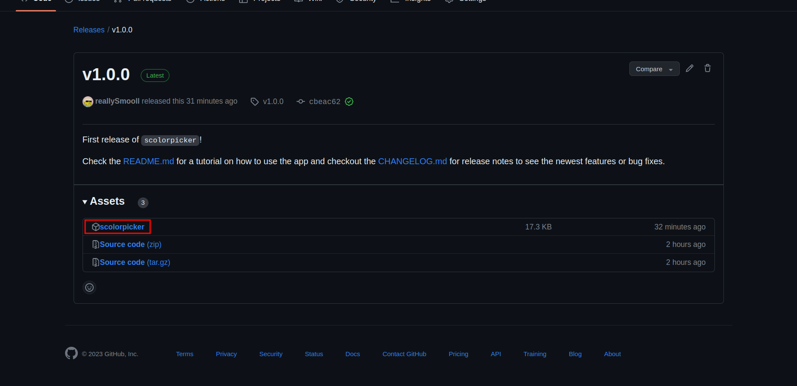

# scolorpicker
scolorpicker is a color picker application written in C using nothing but Xlib.

This is why scolorpicker can be installed anywhere an X.Org server is installed, is very lightweight with the executable clocking in at just 18k and has very little
dependencies (which you probably don't have to install if you use X11).

## Installation
There are three ways of installing scolorpicker:

- Using an AUR wrapper (e.g. `yay` or `paru`) **RECOMMENDED**

    Using `yay`:
    ```bash
    $ yay -S scolorpicker
    ```

    Using `paru`:
    ```bash
    $ paru -S scolorpicker
    ```

- Using the executable from [Releases](https://www.github.com/reallySmooll/scolorpicker/releases)

    First, go to the latest release of scolorpicker (in this case it's `v1.0.0`):

    

    Next, go download the `scolorpicker` executable:

    

    After you download it, you can use it by executing it in the command line:
    ```bash
    $ directory/to/where/you/downloaded/scolorpicker
    ```

    If you'd like to have it in you `PATH` and use it without moving into the directory where you have the executable you can move (or copy) it to `/usr/bin` for example:
    ```bash
    $ sudo mv directory/to/where/you/downloaded/scolorpicker /usr/bin
    # or copy it
    $ sudo cp directory/to/where/you/downloaded/scolorpicker /usr/bin
    ```

    And then wherever you are, you can do:
    ```bash
    $ scolorpicker
    ```

- Building if from source

    First, clone the repository and cd into the directory:
    ```bash
    $ git clone https://github.com/reallySmooll/scolorpicker.git
    $ cd scolorpicker/
    ```

    Next, build and install scolorpicker:
    ```bash
    $ sudo make install
    ```

    And that's it! `make` will build the application automatically and copy the executable into the `/usr/bin/` directory so you can use it like any other command without having to cd into the directory and running it from there!

## Usage
Usage is pretty straight-forward, you start the application and click on the pixel you want to get the color of and it will be copied to your clipboard.

Which means that if everything works out, there should scolorpicker should output nothing to the terminal.

## Features
Here's a list of features already implemented and ones I would like to implement in the (near?) future:

- [X] Small window displaying the color of the current pixel (v1.0.0)
- [X] Color code in hexadecimal (v1.0.0)
- [X] Color output to clipboard (v1.0.0)
- [ ] Color code output in different modes (RGB, HSV, etc.)
- [ ] Ability to choose to output the color code to the terminal instead of the clipboard
- [ ] System tray so you don't have to enter a command in the terminal to get the color of a pixel (which, I'll admit is pretty dumb)
